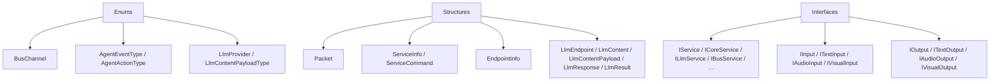

# Ronma.Protocol

## 简介

`Ronma.Protocol` 是 Ronma 的协议与抽象层。

它定义的是跨仓库、跨服务共享的最小公共契约，而不是任何具体实现。当前源码主要包含三类内容：

- 枚举
- 结构体
- 接口

这一层不包含 runtime、总线实现、LLM SDK 适配、存储实现，也不依赖具体服务项目。它的作用是让 `Ronma.Core`、官方服务和第三方服务在同一组稳定协议上协作。

## 架构概览

```text
Enums
  |
  +--> Bus / Agent / Llm 基础枚举

Structure
  |
  +--> Packet / ServiceInfo / EndpointInfo
  +--> LlmEndpoint / LlmContent / LlmResponse / LlmResult

Interface
  |
  +--> Service interfaces
  +--> Input interfaces
  +--> Output interfaces
```

协议层的边界非常明确：

- `Enums` 负责共享语义
- `Structure` 负责共享数据形状
- `Interface` 负责共享能力边界

如果某个概念不需要跨服务共享，就不应该放进 `Ronma.Protocol`。

### 协议层关系图



## 当前源码结构

- `src/Ronma.Protocol/Enums`
  - 基础枚举定义

- `src/Ronma.Protocol/Structure`
  - 跨服务结构体与消息载体

- `src/Ronma.Protocol/Interface`
  - 服务、输入、输出抽象接口

## 枚举

当前枚举包括：

- `BusChannel`
  - `Input / Output / Internal`

- `AgentEventType`
  - `UserInput / Intervention / ServiceResult / FollowUp / System`

- `AgentActionType`
  - `Think / ServiceCall / FollowUp / Final / Error`

- `LlmProvider`
  - `Ollama / OpenAI / Claude / Gemini / Custom`

- `LlmContentPayloadType`
  - `JPG / PNG / GIF / MP3 / MP4 / PDF`

这些枚举的目标是保证不同实现对“同一个事件、动作、通道、模型类型”有一致理解。

## 结构体

### Packet

`Packet` 是 Ronma 分布式通信里的基础消息载体。

当前字段包括：

- `Service`
- `Command`
- `Sender`
- `TraceId`
- `RequestId`
- `SessionId`
- `Args`
- `ReplyTo`
- `ReplyArg`

它承担的是跨服务消息的最小公共格式，而不是某个具体运行时的内部对象。

### ServiceInfo / ServiceCommand

`ServiceInfo` 用来描述一个服务：

- 所在 `BusChannel`
- 服务名
- 命令列表
- 描述文本

`ServiceCommand` 用来描述该服务暴露的单个命令。

这一组结构是 Ronma 把“外围能力统一视为服务”这一设计落到协议层的核心基础。

### EndpointInfo

`EndpointInfo` 用于描述总线或其他外部连接端点，是基础配置结构，不绑定某一种具体实现。

### LLM 相关结构

当前协议层的 LLM 结构包括：

- `LlmEndpoint`
  - provider、uri、defaultModel、apiKey

- `LlmContent`
  - `Model`
  - `Stream`
  - `Prompt`
  - `ResponseSchemaName`
  - `ResponseSchema`
  - `Payloads`

- `LlmContentPayload`
  - 描述多模态附加负载

- `LlmResponse`
  - 更贴近 provider 原始响应
  - 包含 `Done`、duration、token 等字段

- `LlmResult`
  - 更贴近上层 runtime 消费
  - 包含：
    - `Success`
    - `Provider`
    - `Model`
    - `Message`
    - `Error`
    - `FinishReason`
    - `PromptTokens`
    - `CompletionTokens`
    - `TotalTokens`
    - `ReasoningSummary`
    - `Raw`

`LlmContent` 当前已经支持显式 schema 字段，这说明协议层不仅承载“发 prompt”，也承载“声明结构化输出约束”。

## 接口

### 服务接口

`IService` 是所有服务的基础接口，当前只定义：

- `ServiceInfo`
- `Enroll()`
- `Unenroll()`

在此之上，协议层提供了一组类型化服务边界：

- `ICoreService`
- `IInsightService`
- `IMemoryService`
- `IAssistanceService`
- `ILlmService`
- `IBusService`

其中当前真正带具体方法的接口主要有：

- `ILlmService`
  - 暴露 `Endpoint`
  - 暴露 `Perform(LlmContent)`

- `IBusService`
  - 暴露 `PublishAsync`
  - 暴露 `SubscribeAsync`

其余几个接口当前更接近“类型边界”或“能力标签”，为不同服务角色保留协议位置。

### 输入输出接口

协议层同时定义了输入输出抽象：

- `IInput / IOutput`
- `ITextInput / ITextOutput`
- `IAudioInput / IAudioOutput`
- `IVisualInput / IVisualOutput`

这一层的目的不是规定具体设备或平台实现，而是为不同模态的桥接服务提供统一接口形状。

## 设计原则

### 协议先于实现

Ronma 的核心层、官方服务和第三方服务都应该先围绕协议协作，再在各自仓库中实现具体行为。

### 保持最小边界

协议层只放跨边界必须共享的内容，不放 runtime 状态机、prompt、路由逻辑、总线实现或存储策略。

### 面向分布式消息

`Packet`、`ServiceInfo`、`TraceId`、`RequestId`、`SessionId` 这些对象的存在，说明 Ronma 的基础协作模型是“消息传递”，不是“共享对象图”。

### 面向可插拔服务

协议层通过 `ServiceInfo` 和 `ServiceCommand` 统一描述服务能力，使 Core、Insight 和第三方实现可以在不共享内部代码的前提下完成互操作。

## 与其他项目的边界

- `Ronma.Common`
  - 负责总线、配置、LLM SDK 适配、存储客户端等基础实现

- `Ronma.Core`
  - 负责路由、prompt、动作分发、会话管理、maintenance 等 runtime 行为

- `Ronma.Services`
  - 负责各种具体服务实现、桥接层和管理界面

`Ronma.Protocol` 只定义共同语言，不定义行为细节。

## 适用对象

- Ronma 核心层开发者
- Ronma 官方服务开发者
- 第三方服务实现者
- 需要编写总线适配层、LLM 适配层或输入输出桥接层的开发者

## 不负责的内容

- 不提供总线默认实现
- 不提供默认 Agent runtime
- 不提供默认存储实现
- 不提供 prompt 或路由策略
- 不提供具体服务逻辑

## 总结

`Ronma.Protocol` 是 Ronma 分布式体系的公共契约层。

它当前已经覆盖了消息传输、服务描述、LLM 调用、输入输出抽象和基础服务接口，是整个 Ronma 生态可独立演进但仍能互操作的底层边界。
